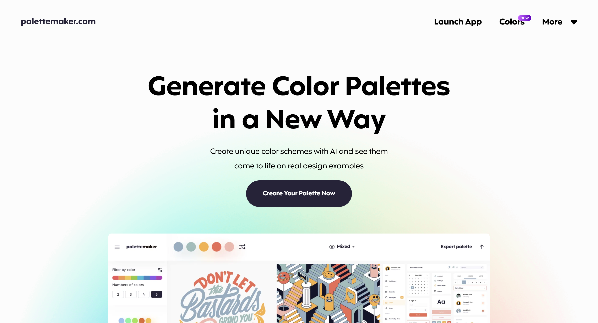
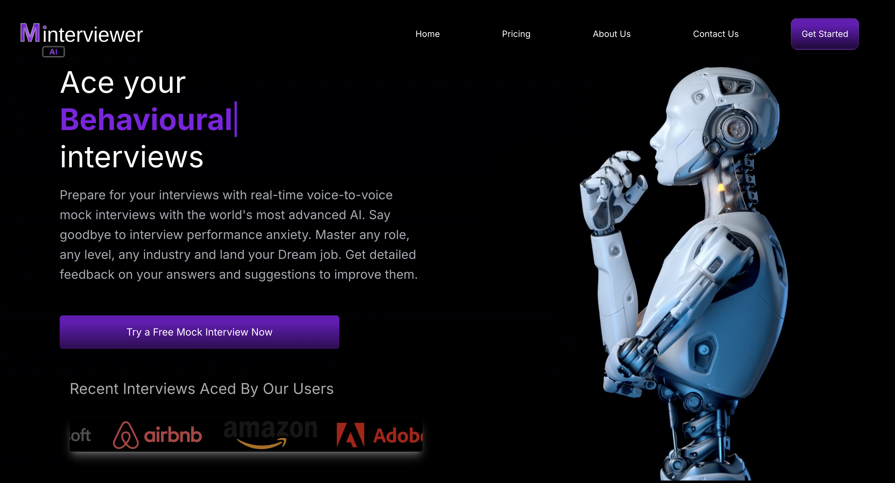
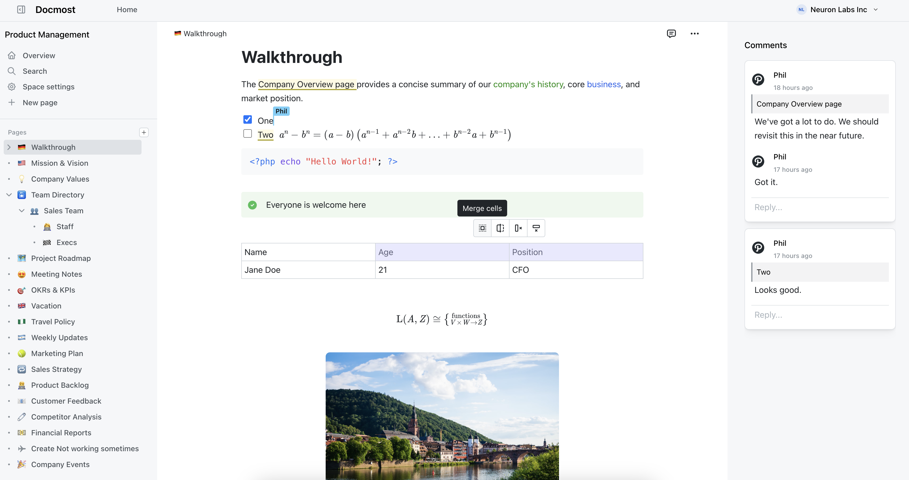

---

description: 欢迎阅读仓鼠周刊！本期我们为您带来了最新的开源项目、科技新闻、技术博客、流行网站、UI组件、精选教程、设计灵感、AI创意和经验分享等内容。希望这些信息能够为您的工作和学习带来启发

---

# 仓鼠周刊（第 1 期）

发布于 2024-11-02

:::note

欢迎阅读仓鼠周刊！本期我们为您带来了最新的开源项目、科技新闻、技术博客、流行网站、UI组件、精选教程、设计灵感、AI创意和经验分享等内容。希望这些信息能够为您的工作和学习带来启发

:::

## 潮流网站

### [logo-zanaat](https://www.logozanaat.app/)

**简介：** 一个可以快速设计简单而独特的 logo 的工具。使用 LogoZanaat 免费且易于使用的工具快速设计您的标志，非常适合初学者和专业人士。

### [palettemaker: 颜色生成](https://palettemaker.com/)

**简介：**  Palettemaker是一个独特的 AI 调色板生成器工具，主要面向创意专业人士和色彩爱好者。以下是该网站的主要功能和特点：

### [mock-interviewer](https://www.mockinterviewer.ai/)

**简介：** 与人工智能进行实时语音面试练习。借助世界上最先进的人工智能进行实时语音模拟面试，为你的面试做准备。告别面试表现焦虑。掌握任何角色、任何级别、任何行业的面试技巧，获得你梦寐以求的工作。对你的回答获得详细反馈以及改进建议

## 开源项目

### [MiKaPo](https://mikapo.amyang.dev/)

**简介：** MiKaPo 是一个基于 Web 的工具，它可以从视频输入中实时对 MMD 模型进行摆姿。它具备多种功能，包括姿势检测、面部检测、手部检测（实验性）、基于 Rust - WASM 的姿势到四元数求解器、360 度背景选择、视频和图像上传、网络摄像头输入、模型选择等。它使用了如 Mediapipe 进行 3D 关键点检测、Babylon.js 构建 3D 场景、babylon - MMD 作为 MMD 模型查看器以及 Vite + React 作为 Web 框架，模型来自 aplaybox

### [docmost](https://docmost.com/)

**简介：** Docmost 是一款开源的协作式维基和文档软件，旨在为用户提供无缝的知识创建、协作和分享体验。它非常适合于管理维基、知识库、文档等。Docmost 提供实时协作的富文本编辑器，支持多人同时编辑页面，并具备图表、表格、数学公式（LaTex）等多种功能。它拥有强大的权限系统，可以控制谁可以查看、编辑和管理内容，确保信息的安全性和可访问性。通过“空间”和“群组”功能，用户可以组织内容到不同的团队、项目或部门，并统一管理用户权限。Docmost 还集成了内联评论系统，允许在页面上直接进行有意义的讨论。页面历史功能允许用户查看每个页面的变更历史，并在需要时回退到之前的版本。其搜索功能由 Postgres 全文搜索系统提供支持，能够快速定位跨所有页面的信息。Docmost 支持页面的嵌套，用户可以通过简单的拖放功能直接从侧边栏管理页面顺序。此外，用户还可以轻松地将图片和视频作为附件添加到页面，Docmost 支持 S3 和本地存储驱动

**关键词：** 实时协作, 知识管理, 文档共享

### [deep-live-cam](https://github.com/hacksider/Deep-Live-Cam)

**简介：** Deep-Live-Cam 是一个基于 Python 开发的开源项目，它能够实现实时人脸替换和一键视频深度伪造，只需一张单图像即可操作。该项目旨在为人工智能媒体行业提供帮助，比如帮助艺术家轻松实现定制角色的动态化，或将其作为服装等设计的模板。项目团队内置了严格的筛选机制，防止被用于不适宜的内容生成，例如它有个内置检查功能，可防止程序处理一些不适当的内容，如裸体、暴力血腥、敏感材料等。其主要特点包括：
• 

---

