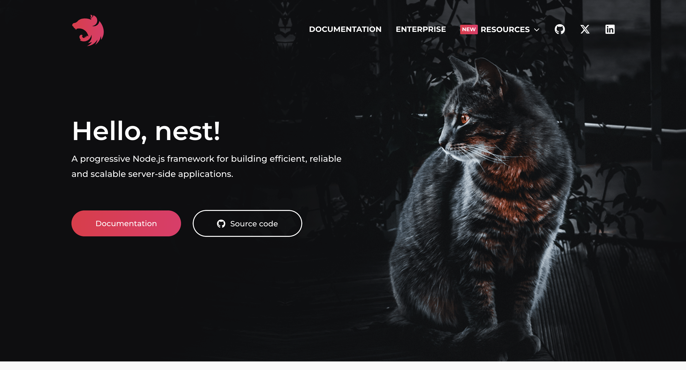
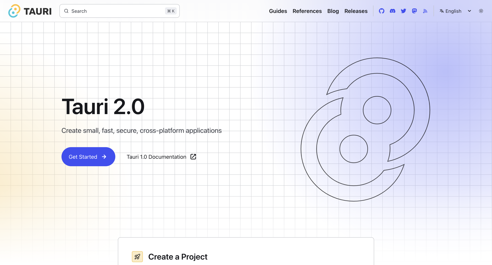
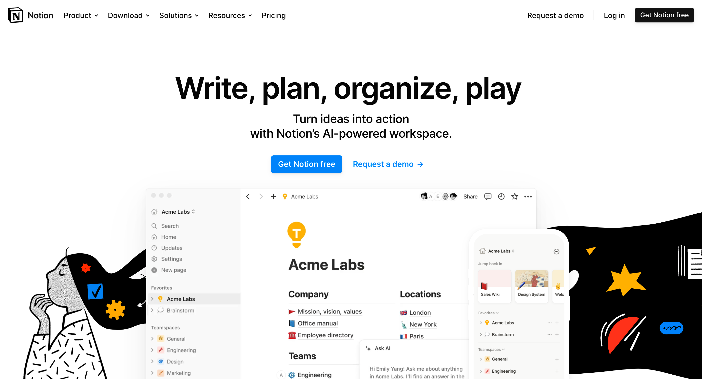
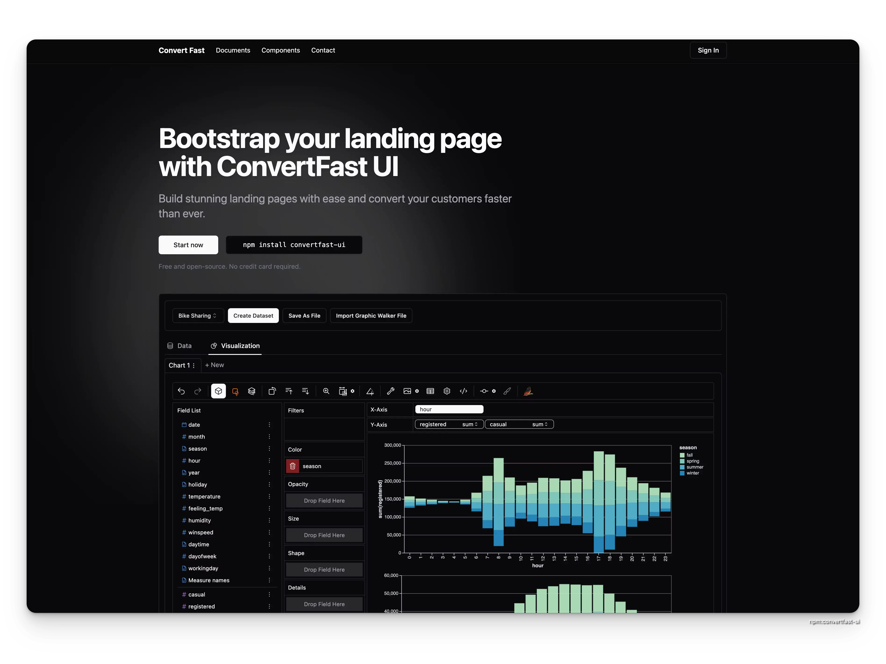
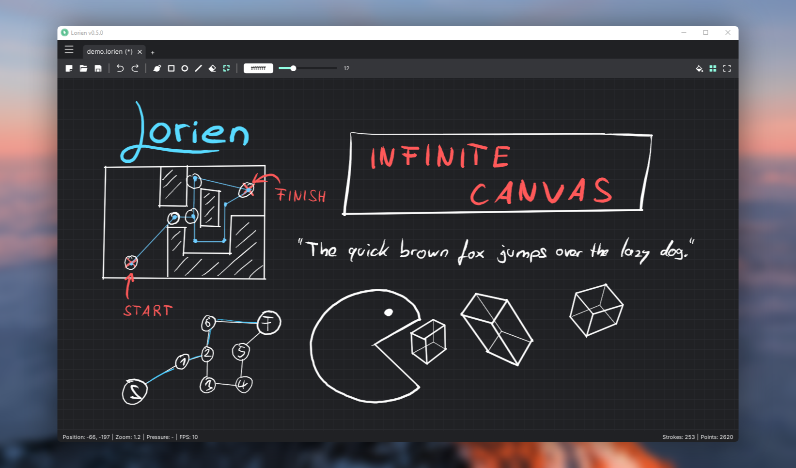
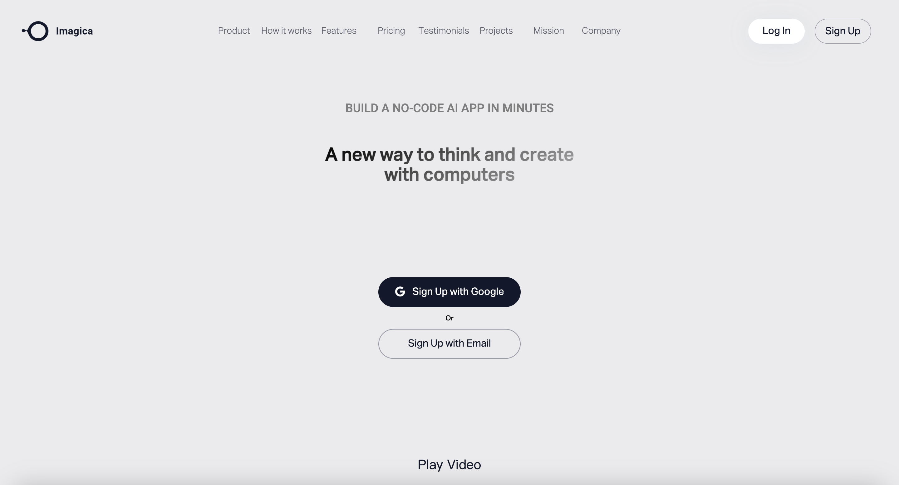
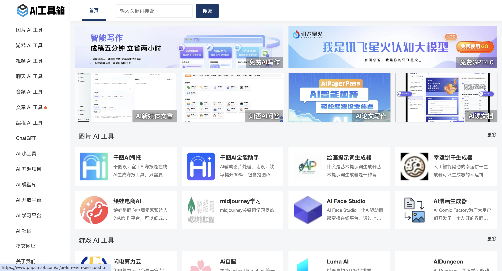

---

description: 欢迎阅读本周的仓鼠！本期我们为您带来了最新的开源项目、科技新闻、技术博客、流行网站、UI组件、精选教程、设计灵感、AI创意和经验分享等内容。希望这些信息能够为您的工作和学习带来启发

---

# 仓鼠周刊（第 2 期）

发布于 2024-11-08

:::note

欢迎阅读本周的仓鼠！本期我们为您带来了最新的开源项目、科技新闻、技术博客、流行网站、UI组件、精选教程、设计灵感、AI创意和经验分享等内容。希望这些信息能够为您的工作和学习带来启发

:::

## 流行框架

### [nestjs](https://docs.nestjs.com/)

**简介：** NestJS 是一个用于构建高效、可扩展的 Node.js 服务器端应用程序的框架。它采用模块化架构，结合了面向对象编程、函数式编程和最新的 JavaScript 特性。支持依赖注入，易于测试和维护，深受开发者青睐

### [tauri](https://tauri.app/)

**简介：** Tauri 是一个跨平台应用框架。它使用前端技术构建应用，具有小巧、安全、高效的特点。通过与系统底层紧密结合，提供出色的性能和用户体验。让开发者能轻松打造出美观且功能强大的桌面应用程序。

### [notion](https://www.notion.so/product)

**简介：** Notion 是一款功能强大的知识管理与协作工具。它集文档、任务管理、数据库等多种功能于一体，可自定义页面布局。支持多人协作，让团队沟通更高效。Notion 以其灵活性和实用性，成为众多用户提升效率的得力助手。

## 开源项目

### [convertfast-ui](https://ui.convertfa.st/)

**简介：** 免费开源的生成落地页的工具，只要一条命令就可以生成落地页。

### [set-up](https://set.yago.sh/)

**简介：** Rust实现的一个多用户实时卡牌游戏

### [lorien](https://github.com/mbrlabs/Lorien)

**简介：**  Lorien 是一款无限画布绘图 / 笔记应用程序，注重性能、小的存储文件和简洁性。它不像 Krita、Gimp 或 Photoshop 那样基于位图图像；而是将笔触保存为一组点，并在运行时进行渲染（有点像 SVG）。它主要被设计用作数字笔记本和头脑风暴工具。虽然它完全可以用于制作小草图和图表，但它并不旨在取代基于位图图像的传统绘图程序。它完全由 Godot 游戏引擎编写

## AI创意

### [imagica](https://www.imagica.ai/)

**简介：** Imagica 是一个充满创意的在线平台。它提供丰富多样的图像资源与创意工具，助力用户释放想象力。无论是专业设计师还是普通爱好者，都能在这里找到灵感，轻松打造出令人惊艳的视觉作品，开启一场独特的视觉之旅。

### [AI工具箱](https://www.phpcms9.com/)

**简介：** AI工具想，提供多种炫酷的AI工具，总有一款适合你

---

