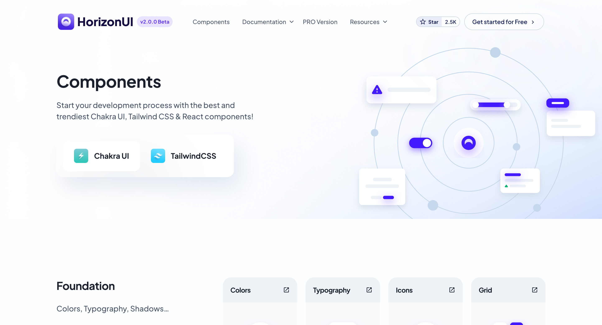

# 第 2 期：组件库测试长度可能会很长，看看效果

发布于 2024-10-19

欢迎阅读本周的科技文摘！本期我们为您带来了最新的开源项目、科技新闻、技术博客、流行网站、UI组件、精选教程、设计灵感、AI创意和经验分享等内容。希望这些信息能够为您的工作和学习带来启发

## 组件

### [horizon-ui](https://horizon-ui.com/boilerplate-shadcn/)

有一个组件库

关键字: TailwindCSS

