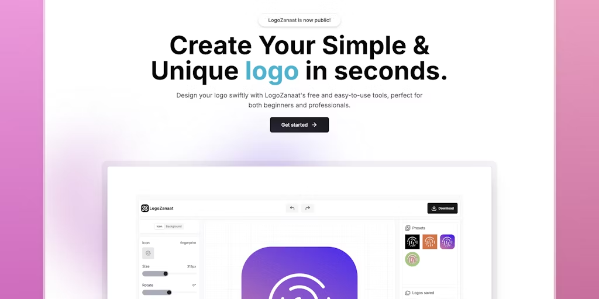

# 第 3 期：正式发布前的准备

发布于 2024-10-21

欢迎阅读本周的科技文摘！本期我们为您带来了最新的开源项目、科技新闻、技术博客、流行网站、UI组件、精选教程、设计灵感、AI创意和经验分享等内容。希望这些信息能够为您的工作和学习带来启发

## 开源

### [lorien](https://github.com/mbrlabs/Lorien)

 无限画布工具

### [deep-live-cam](https://github.com/hacksider/Deep-Live-Cam)

AI实时换脸

## AI

### [unapod](https://unapod.com/)

### [diagramly](https://diagramly.ai/)

AI驱动的 Diagramly 可以把文字或图像转化为可编辑的

## 工具

### [sink](https://sink.cool)

开源短链工具

### [annotate:](https://annotate.dev/)

makes it easy for devrels, educators, and engineers to explain code step-by-step

### [logo-zanaat](https://www.logozanaat.app/)

一个可以快速设计简单而独特的 logo 的工具

